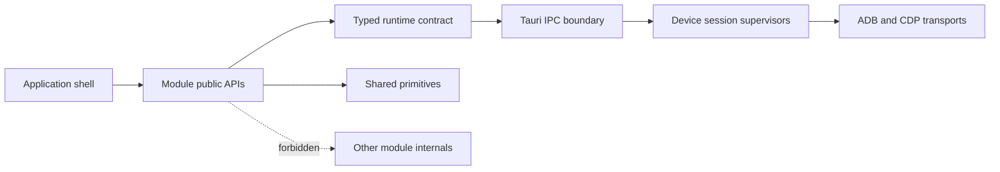
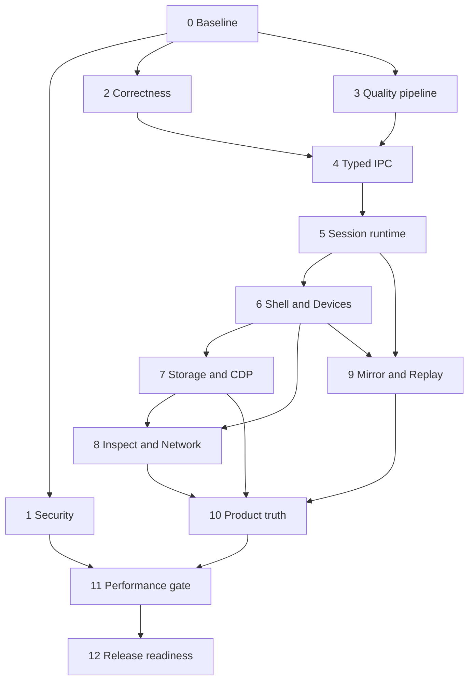

# CapuBridge Architecture Hardening and Modularization Plan

Status: Proposed implementation plan  
Source: Full codebase and product audit, 2026-07-16  
Branch: `ayoub/enhancement-architecture-hardening`

## 1. Objective

Move CapuBridge from a promising but uneven beta into a secure, modular, testable, and scalable developer tool without stopping feature delivery for a long rewrite.

The work is organized as tracer-bullet phases. Each phase produces a usable and independently verifiable improvement across the necessary layers. Existing behavior is migrated incrementally; there is no big-bang frontend or Rust rewrite.

The plan resolves four classes of work:

1. Contain security and correctness risks that can affect real devices or production builds.
2. Establish enforceable contracts for IPC, errors, module boundaries, concurrency, tests, and releases.
3. Migrate each product area into a self-contained module with a narrow public API.
4. Remove misleading or dead product surfaces before adding the next tier of features.

## 2. Current and desired state

| Area                  | Current state                                                                                                   | Desired state                                                                                                                              |
| --------------------- | --------------------------------------------------------------------------------------------------------------- | ------------------------------------------------------------------------------------------------------------------------------------------ |
| Security              | Main WebView can expose a fixed remote-debugging port; CSP and capabilities are broad                           | Privileged UI is never remotely debuggable in production; previews are isolated; CSP and capabilities are least-privilege                  |
| Device execution      | Shared ADB connection exists, but a global mutex and blocking worker operations limit cancellation and fairness | One managed ADB server connection with per-device scheduling, timeouts, cancellation, priority, and clean shutdown                         |
| Frontend architecture | Feature folders exist, but routing, stores, composables, and types remain globally coupled                      | Self-contained modules own routes, UI, state, services, types, locales, and tests; modules depend only on shared contracts                 |
| IPC                   | Type declarations are manually maintained, many invokes are untyped, and Rust exposes string errors             | One generated or mechanically verified contract with typed payloads, typed results, structured errors, and schema checks                   |
| State and effects     | Pinia, TanStack Query, direct invokes, and a duplicated Effect layer overlap                                    | Clear ownership: Query for remote data, Pinia for durable UI/domain state, one IPC client, Effect only where scoped concurrency adds value |
| Product truth         | Stable features, mocks, placeholders, and unfinished tabs appear together                                       | Every surface is classified stable, beta, experimental, or hidden; production contains no mock-only workflow                               |
| Quality               | Desktop tests are not included by the root test task; Rust has no meaningful test suite                         | Every package participates in the Vite+ quality graph; critical Rust and frontend flows have deterministic tests                           |
| Releases              | Versions and documentation disagree                                                                             | Root version is canonical and all manifests, notes, tags, and visible version strings are verified before release                          |
| Documentation         | Specification and commands are stale or missing                                                                 | Architecture, product status, development workflow, contracts, and releases reflect executable reality                                     |

## 3. Delivery principles

- Security and data correctness block feature expansion.
- Preserve the single managed ADB daemon connection; never add per-command `adb.exe` process spawning.
- Migrate one end-to-end feature slice at a time and keep the application usable after every phase.
- No module may import another module's internal files. Cross-feature cooperation uses shared contracts, shared primitives, or application-level orchestration.
- Keep shared code small and domain-neutral. Feature-specific code remains in its owning module.
- Long lists use virtualization and remote data uses bounded pagination or streaming.
- Operational failures are visible and actionable; empty catches are not acceptable in device, IPC, storage, preview, mirror, or recording paths.
- Use Vite+ commands only. Do not introduce direct npm, pnpm, Vitest, ESLint, or Vue TypeScript command usage.
- Do not preserve a feature merely because UI already exists. Incomplete or misleading surfaces are hidden or removed until they satisfy their acceptance gate.

## 4. Durable architecture decisions

### 4.1 Security boundary

The privileged CapuBridge application WebView and untrusted inspected content are different trust zones.

- The main application WebView has no production remote-debugging port.
- Any remote debugging needed for development is compile-time or build-profile gated and bound to loopback with no wildcard origin allowance.
- Local previews run in an isolated WebView/window or sandbox with the smallest capability set and no access to privileged application commands.
- CSP is explicit, environment-aware, and deny-by-default for scripts, connections, frames, and navigation.
- Tauri capabilities are split by window and feature instead of granted globally.
- Security-sensitive settings cannot be enabled silently by persisted state.

### 4.2 Frontend module contract

Each module owns its complete feature slice:

```text
modules/<feature>/
  components/
  composables/
  locales/
  services/
  stores/
  tests/
  types/
  public.ts
  routes.ts
```

Rules:

- `public.ts` is the only import surface available to the application shell.
- Modules never import from another module.
- The application shell composes routes and coordinates workflows that span modules.
- `shared/` contains only reusable primitives, infrastructure contracts, and generic presentation components.
- A type used by one module stays in that module. A type representing an IPC or platform contract belongs to the runtime contract package.
- Pinia stores use setup syntax and stay with the module that owns the state.
- Route registration is declarative; the root router does not know module internals.

### 4.3 Backend ownership

The Rust backend owns device connection truth and resource lifecycles.

- A session supervisor owns each device session, command queue, port assignments, cancellation registry, and shutdown state.
- The shared ADB server transport remains singular, while scheduling avoids holding a global lock across blocking reads or long operations.
- Commands declare timeout, cancellation, priority, and idempotency behavior.
- Streaming operations expose explicit start, status, stop, and terminal events.
- Resource cleanup is deterministic on device disconnect, window close, command cancellation, and application exit.

### 4.4 IPC and error contract

- Maintain a single source of truth for command names, parameters, return values, events, and error variants.
- Generate or mechanically validate TypeScript bindings from Rust-facing schemas.
- All frontend invokes have inferred or explicit return types through one client.
- Rust returns structured errors with stable codes, safe user messages, optional technical context, and retryability.
- Validation occurs at the boundary for serials, ports, paths, URLs, expressions, and user-provided scripts.
- Removed and renamed commands fail contract checks during development instead of at runtime.

### 4.5 State, queries, and effects

- TanStack Query owns cached remote/device data and invalidation.
- Pinia owns durable domain selection, workflow state, and UI preferences.
- Local component state owns ephemeral presentation state.
- One runtime client owns Tauri invokes and event subscriptions.
- Effect is retained only at boundaries that benefit from scoped lifetime, cancellation, retries, or dependency injection. Duplicate live implementations and unused layers are removed.
- Components do not invoke Tauri commands directly after their module is migrated.

### 4.6 Version and release policy

- Root `package.json` is the canonical application version.
- Desktop package, Rust crate, Tauri configuration, displayed application version, release notes, and tag must match it.
- Releases use annotated `vX.Y.Z` tags created only after a dedicated version-bump commit.
- CI rejects version drift, uncommitted generated contracts, missing release notes, and invalid tag/version pairs.

### 4.7 Feature maturity policy

Each route and command belongs to one maturity level:

- Stable: complete behavior, tests, error states, documentation, and no known unsafe shortcut.
- Beta: real behavior with clearly declared limitations and telemetry/error reporting.
- Experimental: opt-in, isolated, and never represented as complete.
- Hidden: mock, dead, unsafe, or placeholder behavior excluded from production navigation.

## 5. Target structure

```text
apps/desktop/src/
  app/                 application bootstrap, shell, module registry
  modules/             self-contained product features
  runtime/             typed IPC, events, Effect boundary, platform adapters
  shared/              generic UI, utilities, contracts, and composables

apps/desktop/src-tauri/src/
  app/                 startup, window policy, capability wiring
  runtime/             sessions, scheduling, cancellation, telemetry
  transport/           ADB and CDP transport implementations
  features/            command handlers grouped by product capability
  contract/            shared IPC payloads, results, errors, and events

packages/
  cdp-protocol/        reusable CDP client/protocol package
  ipc-contract/        generated frontend bindings if a separate package is justified
```

The exact folders may evolve during implementation, but ownership and dependency direction are fixed:



## 6. Phase plan

### Phase 0: Baseline, decision records, and enforcement scaffold

**User story:** As a maintainer, I can change the architecture with an agreed target, measurable gates, and no ambiguity about ownership.

**Build:**

- Record architecture decisions for trust zones, module boundaries, IPC contracts, state ownership, Effect usage, session scheduling, and version authority.
- Add dependency-boundary checks that reject cross-module internal imports.
- Define the feature maturity registry and production visibility rule.
- Capture current command, event, route, test, version, and capability inventories as migration baselines.
- Establish performance budgets for startup, memory, large-list interaction, stream latency, and device-command queue delay.

**Depends on:** Nothing.

**Acceptance criteria:**

- Every current route, IPC command, event, and test suite is inventoried.
- Architecture decisions have an owner, rationale, alternatives, and reversal conditions.
- A deliberately invalid cross-module import fails the boundary check.
- No runtime behavior changes in this phase.

**Demo:** Run the architecture checks through Vite+ and show the inventory and maturity classification.

**Suggested commit boundary:** `🏗️ Establish architecture enforcement baseline`

---

### Phase 1: Production security containment

**User story:** As a CapuBridge user, installing a production build does not expose the privileged application UI or grant untrusted previews unnecessary access.

**Build:**

- Remove the production remote-debugging port and wildcard remote-origin configuration from the main WebView.
- Gate development debugging by build profile and explicit local configuration.
- Isolate previews from the privileged application WebView.
- Replace null CSP with an explicit policy and document necessary development exceptions.
- Split Tauri capabilities by window and remove permissions not used by each trust zone.
- Validate navigation, external URL opening, file access, and preview content at their boundaries.
- Add automated assertions for production configuration and window capabilities.

**Depends on:** Phase 0 trust-zone decision.

**Acceptance criteria:**

- A production configuration contains no fixed DevTools port or wildcard remote origin.
- The preview cannot call device, shell, filesystem, or session commands unless explicitly required and documented.
- CSP is non-null and blocks an injected inline script and unapproved connection in a production-policy test.
- Existing device management remains usable from the privileged main window.

**Demo:** Inspect the effective production window arguments, capabilities, and CSP; attempt a prohibited preview-to-privileged invocation.

**Suggested commits:**

- `🔒 Remove production remote debugging exposure`
- `🛡️ Isolate previews and narrow capabilities`
- `✅ Add production security policy tests`

---

### Phase 2: Device-control correctness and cancellation

**User story:** As a developer operating a physical device, I can cancel long work immediately and trust that targeted networking actions affect only the selected rule.

**Build:**

- Move cancellation signaling outside the normal per-device work queue.
- Make package scan, pull, streaming, and other long operations observe cancellation tokens or bounded read deadlines.
- Implement targeted ADB reverse removal using both local and remote rule identity; reserve remove-all for an explicit separate action.
- Add timeouts and terminal states for blocking worker receive paths.
- Surface failures and cancellation consistently in the UI instead of swallowing them.
- Correct theme selection so system, light, and dark modes produce their declared behavior.

**Depends on:** Phase 0 inventory.

**Acceptance criteria:**

- Cancellation is acknowledged within a defined latency while a scan is active; it is not queued behind that scan.
- Removing one reverse rule leaves unrelated rules intact.
- A disconnected device cannot leave an indefinitely blocked worker.
- Every affected operation reaches one terminal state: success, failed, cancelled, or timed out.
- Theme mode tests cover system, explicit light, explicit dark, and persistence.

**Demo:** Start and cancel a long package scan, remove one of multiple reverse mappings, then simulate a device disconnect.

**Suggested commits:**

- `⚡ Make device operations cooperatively cancellable`
- `🐛 Remove only selected reverse mappings`
- `🎨 Correct persisted theme behavior`

---

### Phase 3: Executable quality and release pipeline

**User story:** As a maintainer, one documented Vite+ workflow verifies every package, frontend test, Rust test, version, and release invariant.

**Build:**

- Add the desktop test task to the root recursive test graph.
- Add Rust test execution to a Vite+ task without introducing direct package-manager commands.
- Make `vp run ready` exercise formatting, linting, type checking, all tests, and builds when the maintainer chooses the full readiness gate.
- Replace direct pnpm/npm instructions and scripts with supported Vite+ equivalents.
- Correct root application scripts so names and workspace targets match actual packages.
- Synchronize root, desktop, Cargo, Tauri, displayed, and documented versions.
- Add a version-consistency and tag-consistency check.
- Separate fast local checks from release readiness while keeping both deterministic.

**Depends on:** Phase 0 inventory.

**Acceptance criteria:**

- The root test command runs desktop, shared package, and Rust suites.
- CI cannot pass when a package test suite is silently omitted.
- CI fails on any manifest version mismatch.
- Documentation contains no unsupported package-manager command.
- A dry release check identifies the canonical version and expected annotated tag.

**Demo:** Show all suites in the Vite+ task output, then introduce and detect a temporary version mismatch.

**Suggested commits:**

- `🧪 Wire every test suite into Vite+`
- `🔖 Enforce one canonical release version`
- `🧹 Align workspace scripts and guidance`

---

### Phase 4: Typed IPC and structured errors

**User story:** As a feature developer, I cannot call a nonexistent command, send an invalid payload, or handle an opaque backend failure without the toolchain detecting it.

**Build:**

- Define the canonical command, event, payload, result, and error schemas.
- Generate or validate TypeScript bindings from that contract.
- Introduce one typed runtime client for invokes and subscriptions.
- Define structured error families for device state, validation, timeout, cancellation, transport, protocol, permissions, filesystem, and internal failures.
- Migrate one complete device networking slice first, including UI, store/query, IPC, Rust command, events, and tests.
- Expand the pattern to every command family and remove stale contract declarations and dead handlers.
- Validate command registration against the generated contract.

**Depends on:** Phases 2 and 3.

**Acceptance criteria:**

- There are no untyped frontend invokes.
- A renamed, removed, or incorrectly typed command fails a check before runtime.
- Every exposed Rust command returns a documented structured error envelope.
- UI error messages distinguish retryable disconnects, cancellation, invalid input, and internal failures.
- Legacy command references that do not exist in the backend are removed.

**Demo:** Change a contract field to show a compile-time failure, then exercise success, validation failure, cancellation, and disconnect for the migrated slice.

**Suggested commits:**

- `📜 Define the canonical IPC contract`
- `🧱 Add typed runtime command client`
- `🚦 Introduce structured backend errors`
- `♻️ Migrate commands by capability`

---

### Phase 5: Scalable session runtime

**User story:** As a user with multiple devices, one slow command cannot freeze unrelated work, leaked workers do not accumulate, and session health is understandable.

**Build:**

- Introduce a session supervisor with explicit creation, active, degraded, disconnecting, and closed states.
- Replace global blocking behavior with scoped transport access and per-device scheduling.
- Add command priority classes so cancel, stop, disconnect, and health checks can preempt background scans.
- Add deadlines, bounded queues, backpressure, and cancellation propagation.
- Track worker ownership and join or abort workers deterministically during shutdown.
- Manage forwarded ports per device without component-level assumptions or hardcoded values.
- Expose queue depth, active operation, last error, connection age, and cleanup status through typed session health events.
- Consolidate the duplicate Effect runtime/layer implementation around the single typed client and remove unused abstractions.

**Depends on:** Phase 4 contract and Phase 2 cancellation behavior.

**Acceptance criteria:**

- Long work on one device does not block a command on another device beyond the defined shared-transport budget.
- High-priority cancellation and disconnect actions preempt queued background work.
- All blocking reads have a timeout or cancellation path.
- Repeated connect/disconnect cycles leave no orphan workers, listeners, forwards, or ports.
- Only one authoritative session bridge/runtime implementation remains.
- Session health is visible without parsing logs.

**Demo:** Run concurrent operations on two devices, cancel one, disconnect the other, and inspect clean terminal session state.

**Suggested commits:**

- `⚙️ Add supervised device session lifecycle`
- `🚥 Prioritize cancellable device work queues`
- `🧼 Guarantee deterministic session cleanup`
- `♻️ Consolidate the Effect runtime boundary`

---

### Phase 6: Modular application shell and Devices slice

**User story:** As a feature developer, I can understand, test, and change device management without navigating global routing, stores, composables, and unrelated feature internals.

**Build:**

- Add the application module registry and declarative route composition.
- Establish shared primitives and runtime contracts without moving feature-specific code into shared.
- Migrate Devices as the first complete module: routes, pages, components, composables, services, setup stores, types, locales, and tests.
- Replace cross-module component imports with application orchestration or shared generic primitives.
- Make device selection available as a narrow shared session context rather than exposing Devices internals.
- Enforce module public APIs and forbidden dependency rules in CI.

**Depends on:** Phases 4 and 5.

**Acceptance criteria:**

- Devices owns its full feature slice and exports only its route definition and intentional public contracts.
- No other module imports Devices internals.
- Root routing composes module routes without importing page internals.
- Device selection, details, package scanning, forwards/reverses, and session health still work.
- The boundary checker reports zero cross-module internal imports.

**Demo:** Disable the Devices module registration to remove its routes cleanly, restore it, and exercise the complete device workflow.

**Suggested commits:**

- `🧩 Introduce declarative frontend modules`
- `📱 Migrate Devices into one feature boundary`
- `🚧 Enforce public module APIs`

---

### Phase 7: Storage and CDP protocol modularization

**User story:** As a developer inspecting large application storage, I can navigate and mutate real device data responsively while the storage implementation remains independently maintainable.

**Build:**

- Migrate IndexedDB, Local Storage, Cache API, OPFS, cookies, and SQLite into a Storage module with capability-specific services.
- Break oversized explorers into orchestration, query/data, editor, navigation, and presentation responsibilities.
- Ensure all writes reach the target through CDP or the defined device transport; never fake success with local mutation.
- Use TanStack Query for remote data, server pagination for IndexedDB limits, and virtualization for every potentially long table/tree/list.
- Replace module-to-module data viewers with shared read-only primitives parameterized by contracts.
- Rename the generic `utils` workspace package to a product-specific CDP/protocol package and correct its metadata and public exports.
- Add storage contract, pagination, mutation, disconnect, and large-dataset tests.

**Depends on:** Phase 6 module foundation and Phase 4 typed IPC.

**Acceptance criteria:**

- Storage imports no other module internals and no other module imports Storage internals.
- Lists above 50 items virtualize; IndexedDB requests remain within protocol limits and use server-side pagination.
- Mutations are confirmed against the real target before cache invalidation reports success.
- SQLite and IndexedDB large components are split by responsibility with bounded reactive state.
- The CDP package name, description, exports, tests, and ownership reflect its actual purpose.

**Demo:** Inspect and edit a large IndexedDB store and SQLite database, disconnect mid-request, reconnect, and verify cache and error behavior.

**Suggested commits:**

- `🗄️ Migrate Storage into one feature boundary`
- `⚡ Virtualize and paginate large storage data`
- `📦 Rename and harden the CDP package`
- `✂️ Split oversized storage explorers`

---

### Phase 8: Inspect and Network maturity slice

**User story:** As a hybrid-app developer, Inspect and Network show real, bounded, and correctly labeled target activity without unfinished controls masquerading as working features.

**Build:**

- Migrate Inspect and Network into independent modules with shared CDP/runtime contracts only.
- Move generic JSON, headers, timing, search, and read-only data views into shared primitives where multiple modules genuinely use them.
- Bound request history and payload retention; virtualize request and event streams.
- Add explicit target-disconnect, navigation, backgrounding, and reconnect states.
- Either implement WebSocket inspection, throttling, and other visible controls end to end or hide them behind experimental flags.
- Add deterministic protocol fixtures for request lifecycles, redirects, errors, WebSockets if enabled, and payload truncation.

**Depends on:** Phase 7 CDP package and Phase 6 module foundation.

**Acceptance criteria:**

- Inspect and Network have independent public APIs and no internal cross-imports.
- Request history has documented count and byte limits.
- Navigation and target disconnect do not leave stale success state.
- Production navigation contains no enabled "Coming soon" tab or no-op control.
- Protocol fixtures cover complete and interrupted request lifecycles.

**Demo:** Capture a bounded request stream, navigate the target, disconnect it, and show accurate recovery or terminal state.

**Suggested commits:**

- `🔍 Modularize Inspect and Network workflows`
- `📉 Bound and virtualize protocol streams`
- `🧭 Hide unfinished network controls`

---

### Phase 9: Mirror, Recording, and Replay resilience

**User story:** As a user mirroring or recording a device, the stream has a clear lifecycle, cleanup is reliable, and replay does not depend on another feature's internal UI.

**Build:**

- Migrate Mirror and Recording/Replay into separate modules coordinated through shared session and media contracts.
- Split mirror transport, decoding, input mapping, state machine, statistics, and presentation responsibilities.
- Replace silent operational catches with classified errors, fallback behavior, and terminal state updates.
- Bound frame, input, log, and recording buffers; expose dropped-frame and backpressure metrics.
- Make Replay consume shared read-only event/data primitives instead of Storage components.
- Ensure window close, route leave, device disconnect, and explicit stop release all listeners, encoders, decoders, processes, and temporary files.
- Add lifecycle tests for start, active stream, degraded stream, stop, cancellation, disconnect, and replay of partial recordings.

**Depends on:** Phase 5 sessions and Phase 6 modules.

**Acceptance criteria:**

- Mirror and Recording/Replay import no module internals.
- One explicit state machine defines every stream transition.
- There are no empty catches in operational mirror, recording, or replay paths.
- Repeated start/stop cycles remain within the memory and worker budgets.
- Partial or corrupt recordings fail safely with actionable feedback.

**Demo:** Start, degrade, recover or stop a mirror session; record activity; disconnect; then replay the safely finalized artifact.

**Suggested commits:**

- `🪞 Modularize mirror stream responsibilities`
- `🎥 Harden recording and replay lifecycles`
- `📊 Expose stream health and backpressure`

---

### Phase 10: Product truth, Settings, and remaining surfaces

**User story:** As a user, every visible feature is real, correctly labeled, configurable where promised, and consistent with the product description.

**Build:**

- Apply the maturity registry to navigation, command palette, shortcuts, onboarding, and documentation.
- Remove or hide the mock Capacitor workflow until backed by real device/project behavior.
- Remove the dead Hybrid surface or rebuild it as a defined real workflow; do not keep duplicate terminology.
- Hide the assistant placeholder until it has a product requirement, privacy model, and complete implementation.
- Make Settings control actual persisted behavior with validation and reset semantics, or remove nonfunctional settings.
- Centralize shortcut definitions so display, registration, conflict detection, and documentation use the same source.
- Complete system/light/dark behavior and remove hardcoded theme assumptions.
- Migrate Browser/Preview, Settings, and remaining application surfaces into owned modules or the application shell as appropriate.

**Depends on:** Phases 6 through 9.

**Acceptance criteria:**

- Production contains no mock route, dead route, placeholder assistant, no-op button, or fake setting.
- Every visible feature has a maturity label and documented limitations where applicable.
- Settings changes demonstrably affect runtime behavior and survive restart when intended.
- Shortcut conflicts are detected and the displayed shortcut always matches the registered one.
- Product documentation and navigation use consistent feature names.

**Demo:** Walk every production navigation item and command; each completes a real workflow or communicates a tested beta limitation.

**Suggested commits:**

- `🧭 Align navigation with product maturity`
- `⚙️ Make settings behavior truthful`
- `⌨️ Centralize application shortcuts`
- `🧹 Remove mock and dead surfaces`

---

### Phase 11: Performance, resilience, and observability gate

**User story:** As a maintainer, I can prove CapuBridge remains responsive and resource-bounded during long multi-device sessions, and diagnose degradation without reproducing it blindly.

**Build:**

- Add performance scenarios for cold start, device discovery, large storage datasets, network capture, mirror streaming, and repeated connect/disconnect cycles.
- Enforce bounded retention for logs, network bodies, frames, events, query caches, and recording metadata.
- Add structured local diagnostics for session lifecycle, queue latency, command duration, timeouts, cancellation, transport errors, and resource cleanup.
- Provide a privacy-reviewed diagnostic export with secrets and target content redacted by default.
- Lazy-load Monaco, SQLite WASM, mirror/recording codecs, and other heavy feature assets at their module boundaries.
- Add regression budgets to CI where deterministic and a documented profiling checklist where environment variance is too high.
- Review every file over the agreed complexity threshold and split by responsibility or record a justified exception.

**Depends on:** Phases 5 through 10.

**Acceptance criteria:**

- Defined startup, interaction, queue, memory, and cleanup budgets are measured and documented.
- No unbounded user- or device-driven collection remains.
- Diagnostics can reconstruct a failed operation's session, command, duration, and terminal reason without exposing secrets by default.
- Heavy feature assets do not load before their feature is opened.
- Every oversized source file is reduced or has an approved exception and owner.

**Demo:** Run a sustained multi-device scenario, export redacted diagnostics, and compare measurements with the budgets.

**Suggested commits:**

- `📏 Add measurable performance budgets`
- `🧠 Bound long-session memory growth`
- `🩺 Add privacy-safe runtime diagnostics`
- `✂️ Reduce oversized source responsibilities`

---

### Phase 12: Documentation, governance, and release readiness

**User story:** As a contributor or release owner, documentation describes the system that actually ships and the release process cannot publish an inconsistent artifact.

**Build:**

- Create the missing maintained product specification and map feature maturity to it.
- Publish architecture documentation for modules, session runtime, IPC, security boundaries, data ownership, and dependency rules.
- Repair malformed or stale documentation and remove commands that contradict Vite+ policy.
- Add contributor guidance for tests, contracts, error handling, performance budgets, and feature flags.
- Add the intended license file and correct package metadata.
- Add release notes grouped by user-facing capability and operational change.
- Run the full readiness gate and close or explicitly defer every audit item.
- Prepare a release checklist that validates version synchronization, annotated tags, generated artifacts, migrations, documentation, and rollback instructions.

**Depends on:** All preceding stabilization phases.

**Acceptance criteria:**

- The product specification, navigation, maturity registry, and implemented features agree.
- A new contributor can locate module ownership, add a typed command, and run all required checks from documentation alone.
- Package names, descriptions, versions, repository data, and license are correct.
- The full readiness workflow passes with every test suite present.
- Every audit finding is closed, accepted with rationale, or linked to a scheduled follow-up.

**Demo:** Perform a release dry run from a clean checkout and generate the expected version/tag/release-note result without publishing it.

**Suggested commits:**

- `📚 Align specifications with shipped behavior`
- `⚖️ Correct licensing and package metadata`
- `🚀 Add enforceable release readiness gates`

## 7. Dependency and delivery sequence



Phases 1 and 3 can progress independently after Phase 0. Phases 7, 8, and 9 may overlap only after the module and runtime contracts are stable and each phase has a separate ownership area. Security, correctness, contract, and session gates must not be deferred behind product additions.

## 8. Audit finding coverage

| ID      | Finding                                                        | Severity | Resolution phase | Required outcome                                            |
| ------- | -------------------------------------------------------------- | -------- | ---------------- | ----------------------------------------------------------- |
| SEC-01  | Production main WebView remote-debug port and wildcard origins | P0       | 1                | Remove in production; development-only gated path           |
| SEC-02  | Null CSP                                                       | P0       | 1                | Explicit tested CSP                                         |
| SEC-03  | Broad Tauri capabilities                                       | P0       | 1                | Per-window least privilege                                  |
| COR-01  | Scan cancellation queued behind scan                           | P1       | 2, 5             | Out-of-band cooperative cancellation                        |
| COR-02  | Targeted reverse removal removes all rules                     | P1       | 2                | Exact rule deletion and regression test                     |
| COR-03  | Theme behavior disagrees with selected mode                    | P1       | 2, 10            | Correct system/light/dark state                             |
| REL-01  | Root, desktop, Cargo, Tauri, and docs versions disagree        | P1       | 3, 12            | One canonical synchronized version                          |
| TST-01  | Desktop tests omitted from recursive test workflow             | P1       | 3                | All suites executed through Vite+                           |
| TST-02  | Rust backend lacks meaningful tests                            | P1       | 2-5, 11          | Critical path and lifecycle tests                           |
| MOD-01  | Feature folders are not self-contained modules                 | P1       | 6-10             | Module-owned routes, state, services, types, locales, tests |
| MOD-02  | Cross-module component imports                                 | P1       | 6-10             | Zero internal cross-module imports                          |
| MOD-03  | Centralized router and global feature state                    | P1       | 6                | Declarative routes and owned stores                         |
| CMP-01  | Many files exceed maintainable responsibility limits           | P1       | 7, 9, 11         | Split or documented exception                               |
| RUN-01  | Global ADB mutex can serialize unrelated work                  | P1       | 5                | Scoped transport access and per-device scheduling           |
| RUN-02  | Blocking receive paths lack timeout/cancel                     | P1       | 2, 5             | Bounded waits and terminal states                           |
| RUN-03  | Worker/listener lifecycle can leak                             | P1       | 5, 9, 11         | Deterministic cleanup tests                                 |
| DOC-01  | Session generation documentation overclaims implementation     | P2       | 0, 5, 12         | Documentation matches actual lifecycle model                |
| IPC-01  | Manual stale IPC declarations                                  | P1       | 4                | Generated or mechanically verified contract                 |
| IPC-02  | Untyped invokes                                                | P1       | 4                | Zero untyped invokes                                        |
| IPC-03  | Opaque string errors                                           | P1       | 4                | Structured stable error taxonomy                            |
| EFF-01  | Duplicated and unused Effect layers                            | P2       | 4, 5             | One justified runtime boundary                              |
| UX-01   | Mock Capacitor surface                                         | P1       | 10               | Real implementation or hidden                               |
| UX-02   | Dead Hybrid surface                                            | P2       | 10               | Remove or define and implement                              |
| UX-03   | Network controls marked Coming soon                            | P2       | 8, 10            | Implement or hide                                           |
| UX-04   | Assistant placeholder                                          | P2       | 10               | Remove until specified and complete                         |
| UX-05   | Fake or ineffective Settings                                   | P1       | 10               | Functional persisted settings or removal                    |
| UX-06   | Hardcoded dark-mode assumptions                                | P2       | 2, 10            | Token-driven theme behavior                                 |
| TOOL-01 | Direct package-manager usage conflicts with Vite+              | P1       | 3, 12            | Vite+-only executable workflow                              |
| TOOL-02 | Root dev target/name mismatch                                  | P2       | 3                | Correct workspace task                                      |
| DOC-02  | Missing specification and stale/malformed docs                 | P1       | 12               | Maintained specification and repaired docs                  |
| PKG-01  | `utils` package is actually a CDP SDK with starter metadata    | P2       | 7, 12            | Purposeful package name, metadata, exports                  |
| LEG-01  | Missing intended license artifact                              | P1       | 12               | Explicit valid license and metadata                         |
| ERR-01  | Operational failures swallowed by empty catches                | P1       | 2, 4, 9, 11      | Classified handling or explicit safe fallback               |
| PERF-01 | Long lists and protocol data are not uniformly bounded         | P1       | 7-9, 11          | Pagination, virtualization, retention limits                |

## 9. Add, retain, hide, and remove

### Add

- Module registry and dependency-boundary enforcement.
- Typed IPC/event contract generation or verification.
- Structured error taxonomy and UI mapping.
- Session supervision, cancellation, timeouts, priorities, backpressure, and health events.
- Production security configuration tests.
- Desktop and Rust test integration in Vite+.
- Feature maturity registry and release/version checks.
- Performance budgets and privacy-safe diagnostic export.
- Maintained product specification, architecture records, release checklist, and license.

### Retain and strengthen

- The single managed ADB daemon connection.
- Vue 3 Composition API and setup Pinia stores.
- TanStack Query for device/CDP remote data.
- TanStack Table and virtualization for large datasets.
- Devices, Storage, Inspect, Mirror, Recording, and Replay as the core product direction.
- CDP writes against the real target.

### Hide until complete

- Mock Capacitor workflows.
- Assistant placeholder.
- Network/WebSocket/throttling controls without real implementation.
- Any experimental command or preview capability that lacks a security and lifecycle gate.

### Remove or replace

- Production remote debugging of the privileged main WebView.
- Wildcard remote origin permission.
- Null production CSP.
- Dead Hybrid route and duplicate feature language.
- Fake settings and no-op controls.
- Direct module-internal cross-imports.
- Stale IPC declarations and nonexistent command signatures.
- Duplicate Effect runtime/layer implementations.
- Unsupported package-manager commands and starter package metadata.
- Empty operational catches.

## 10. Global definition of done

A remediation phase is complete only when all applicable conditions hold:

- Its user workflow works end to end against real or deterministic simulated device behavior.
- Success, empty, loading, cancelled, timed-out, disconnected, validation-error, and internal-error states are handled.
- Public contracts and module boundaries are enforced automatically.
- Tests are part of the root Vite+ task graph and cannot be skipped silently.
- No new unbounded collection, blocking wait, cross-module internal import, direct component invoke, mock production behavior, or opaque error is introduced.
- Performance and cleanup behavior are verified in proportion to risk.
- Documentation and feature maturity are updated in the same phase.
- The change is split into small feature- or issue-focused commits; commits are not mixed across unrelated phases.
- A rollback path exists for security, runtime, contract, storage migration, and release changes.

## 11. Quality score gates

The following gates replace subjective “looks improved” evaluation:

| Gate                                                   | Target before release readiness |
| ------------------------------------------------------ | ------------------------------- |
| Production privileged WebView debug exposure           | 0                               |
| Production mock/dead/no-op surfaces                    | 0                               |
| Untyped invokes                                        | 0                               |
| Exposed commands returning undocumented opaque errors  | 0                               |
| Cross-module internal imports                          | 0                               |
| Potentially long unvirtualized lists                   | 0                               |
| Indefinite blocking reads without cancellation/timeout | 0                               |
| Operational empty catches                              | 0                               |
| Test suites omitted from root task graph               | 0                               |
| Version mismatches                                     | 0                               |
| Critical session state transitions without tests       | 0                               |
| Oversized files without a split or approved rationale  | 0                               |

Release readiness also requires measured budgets for startup, queue latency, sustained memory, stream backpressure, and cleanup. Numeric thresholds should be recorded from representative supported hardware during Phase 0, tightened during Phase 11, and never invented from a developer workstation alone.

## 12. Rollout and rollback strategy

- Introduce module and runtime migrations behind internal compatibility adapters, then delete adapters once all callers move.
- Keep each phase deployable; do not maintain two sources of truth longer than one migration phase.
- Use feature flags only for incomplete migrations or experimental product capability, not as a permanent substitute for cleanup.
- Preserve data and recording format compatibility or provide an explicit migration/version reader.
- For IPC changes, support one compatibility window only when needed for rolling development; desktop releases package frontend and backend together, so long-lived dual contracts are unnecessary.
- For session runtime changes, keep a temporary selectable legacy scheduler in development builds until multi-device, cancellation, and cleanup tests pass; never ship two uncontrolled schedulers.
- For security changes, rollback means disabling the affected feature, not restoring unsafe production flags.

## 13. Post-hardening product opportunities

These are valuable “level-up” features, but they start only after the corresponding foundations pass:

1. **Connection Health Center** after Phase 5: show ADB/CDP state, queue health, forwarded ports, last failure, and guided recovery.
2. **Incident Bundle** after Phase 11: export redacted diagnostics, selected logs, session timeline, versions, and capability state for bug reports.
3. **Workspace Profiles** after Phase 10: save device/app targets, preferred panels, filters, and safe connection settings.
4. **Cross-tool Timeline** after Phases 8 and 9: correlate network requests, console output, storage changes, mirror inputs, and recording markers.
5. **Capacitor Diagnostics** only after a real specification: plugin inventory, configuration checks, native bridge health, and actionable compatibility warnings.

These additions reinforce CapuBridge's description as an integrated hybrid-app device and inspection tool. They should not compete with security containment, cancellation correctness, typed contracts, modularization, or test coverage.

## 14. Explicit non-goals

- Rewriting the entire application or backend in one phase.
- Replacing Vue, Pinia, TanStack Query, Tauri, or the managed ADB transport without evidence that the current technology blocks a requirement.
- Pursuing line-coverage percentages without critical-path assertions.
- Adding cloud accounts, collaboration, or AI features before the local security and privacy model is specified.
- Shipping unfinished UI to create the appearance of feature breadth.
- Running release publication automatically as part of this remediation plan.
